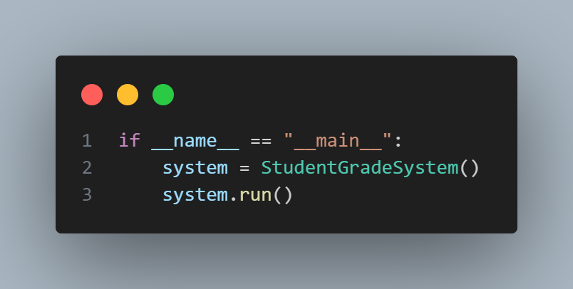

# Data Diri
 
 Nama   : Zizantara Arzeva Cakra Kahana

 NIM    : 312410398

 Kelas  : TI.24.A.3

# Flowchart

# Program Input Nilai

## Input Program 

## Output Program 
 
 - Output yang di hasilkan ketika menginput ( L )

    

 - Output yang di hasilkan ketika menginput ( T )

    

 - Output yang di hasilkan ketika menginput ( L ) setelah Menginput ( T )

    

 - Output yang di hasilkan ketika menginput ( U )

    

 - Output yang di hasilkan ketika menginput ( L ) setelah Menginput ( U )

    

 - Output yang di hasilkan ketika menginput ( H )

    

 - Output yang di hasilkan ketika menginput ( L ) setelah Menginput ( H )

    

 - Output yang di hasilkan ketika menginput ( C )

    

 - Output yang di hasilkan ketika menginput ( K )

    

# Deskripsi Program 

1. STRUKTUR CLASS DAN INISIALISASI

    

    - Program menggunakan class StudentGradeSystem untuk mengorganisir kode dan data.

    - __init__ adalah constructor yang dijalankan saat objek dibuat.

    - self.students adalah dictionary kosong yang akan menyimpan data dengan struktur:

    

2. PERHITUNGAN NILAI AKHIR

    

    - Method untuk menghitung nilai akhir sesuai bobot yang ditentukan:

        - Tugas: 30% (0.30)

        - UTS: 35% (0.35)

        - UAS: 35% (0.35)

    - Menerima 3 parameter: nilai tugas, UTS, dan UAS

    - Mengembalikan hasil perhitungan sebagai nilai float

3. PENAMBAHAN DATA MAHASISWA

    

    - Memulai dengan mengecek duplikasi NIM

    - Jika NIM sudah ada, tampilkan pesan error dan keluar dari fungsi

    

    - Input data mahasiswa dengan validasi:

        - Mengkonversi input nilai ke float

        - Memastikan semua nilai antara 0-100

        - Menggunakan try-except untuk menangani input non-numerik

    

   - Menghitung nilai akhir

   - Menyimpan data dalam dictionary dengan struktur nested

4. PEMBARUAN DATA MAHASISWA

    

    - Mencari NIM yang akan diupdate

    - Validasi keberadaan NIM sebelum melakukan update

    

    - Proses input dan validasi sama seperti penambahan data

    

    - Menggunakan method update() untuk memperbarui data yang ada

5. PENGHAPUSAN DATA

    

    - Menggunakan operator del untuk menghapus data dari dictionary

    - Validasi keberadaan NIM sebelum menghapus

6. PENCARIAN DATA

    

    - Mencari data berdasarkan NIM

    - Menampilkan data dalam format tabel jika ditemukan

    - Menggunakan string formatting untuk alignment:

        - ^ untuk center alignment

        - < untuk left alignment

        - .2f untuk format float dengan 2 desimal

7. MENAMPILKAN DATA

    

    - Mengecek apakah dictionary kosong

    - Menampilkan pesan khusus jika tidak ada data

    

    - Menggunakan enumerate() untuk memberikan nomor urut

    - Iterasi melalui dictionary menggunakan items()

    - Menampilkan data dalam format tabel yang rapi

8. MENU UTAMA

    

    - Menggunakan dictionary untuk memetakan pilihan menu ke method yang sesuai

    - Memudahkan penambahan menu baru di masa depan

    

    - Loop utama program

    - Mengkonversi input ke lowercase untuk fleksibilitas

    - Eksekusi method sesuai pilihan menu

    - Validasi input menu

9. MENJALANKAN PROGRAM

    

    - Membuat instance dari class StudentGradeSystem

    - Menjalankan program saat file dieksekusi langsung

# FITUR KEAMANAN DAN VALIDASI:

1. Validasi Input:

    -  Pengecekan duplikasi NIM

    - Validasi rentang nilai (0-100)

    - Penanganan input non-numerik dengan try-except

    - Validasi menu yang dipilih

2. Keamanan Data:

    - Data tersimpan dalam struktur dictionary yang terorganisir

    - Tidak ada akses langsung ke data dari luar class

    - Validasi sebelum modifikasi data

3. User Interface:

    - Menu yang jelas dan mudah dipahami

    - Pesan error yang informatif

    - Format tampilan yang konsisten dan rapi

    - Konfirmasi untuk operasi penting